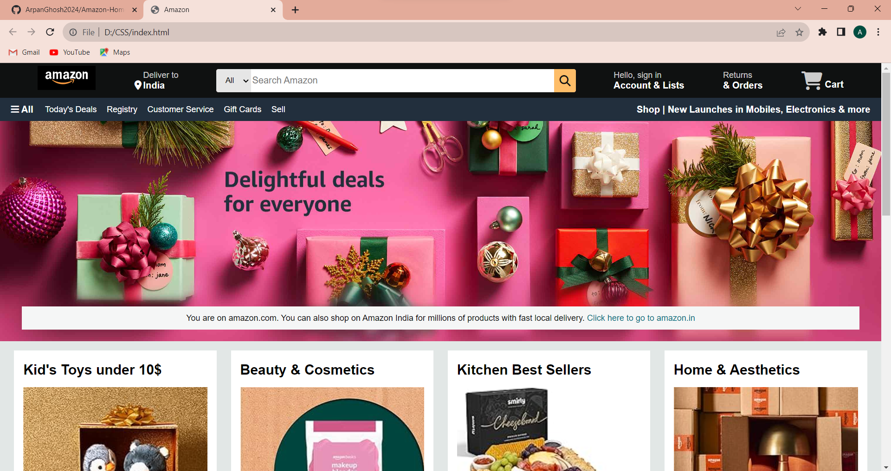
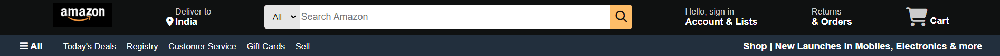
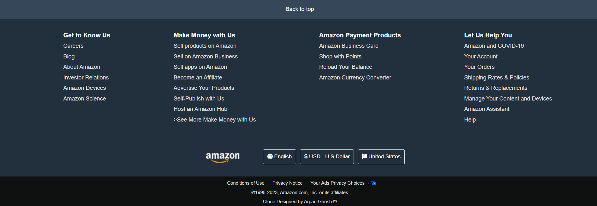
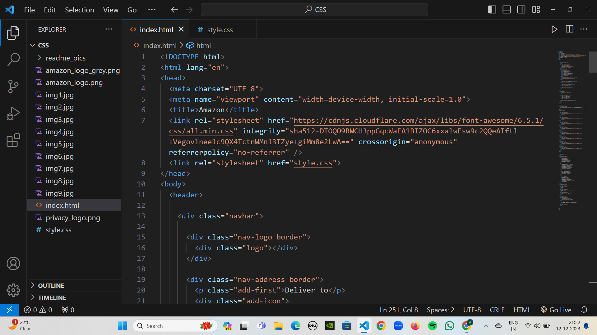
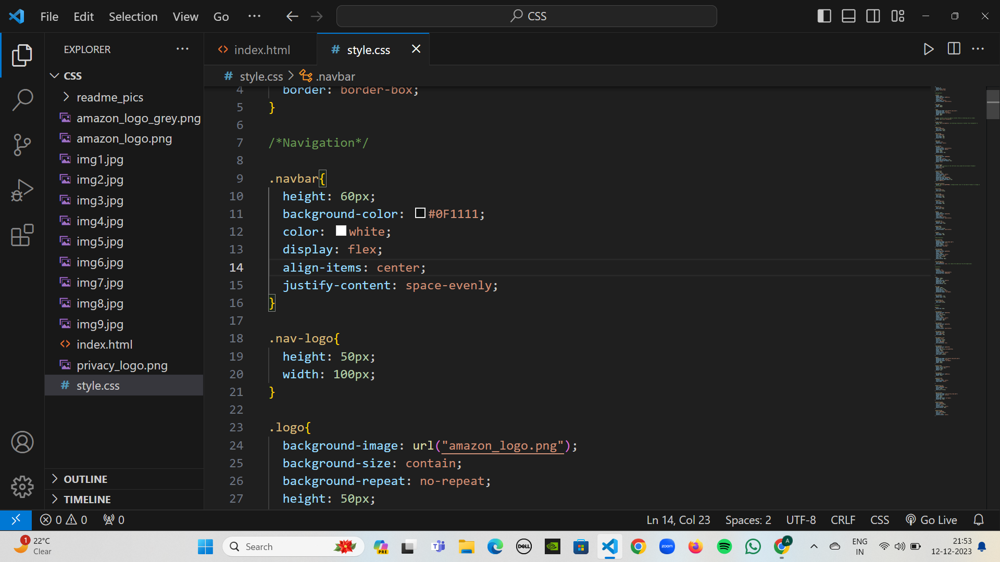
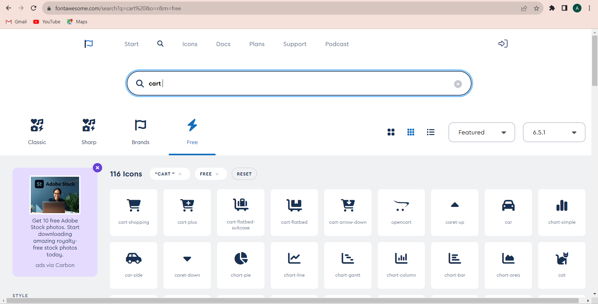

# Amazon-Homepage-Clone-using-HTML-and-CSS
In this project, I have developed the clone of Amazon's home page from scratch using HTML and CSS. In this project, I tried to re-create just the design or the look and feel of Amazon's homepage and did not work on the actual functionality of the website.
<h2><ins>Final Outcome: -</ins></h2>

This is how the final webpage looks like.    
The entire webpage consists of the following sections: -
<ol>
<li><b>The NavBar and the Navigation section</b>
    
</li>
   
<li><b>The Hero Section</b>
    
</li>
   
<li><b>The Content Section</b>
    
</li>
   
<li><b>The Footer</b>
    
</li>
</ol>
 
<h2><ins>IDE Used - Visual Studio Code (VS Code)</ins></h2>

 
<h2><ins>Font Awesome</ins></h2>
I have used Font Awesome to include the necessary icons/logos in my project - https://fontawesome.com/. So special thanks to them.

 
<b><i>So, I really hope that you liked this project of mine!</i></b>😊
